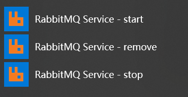
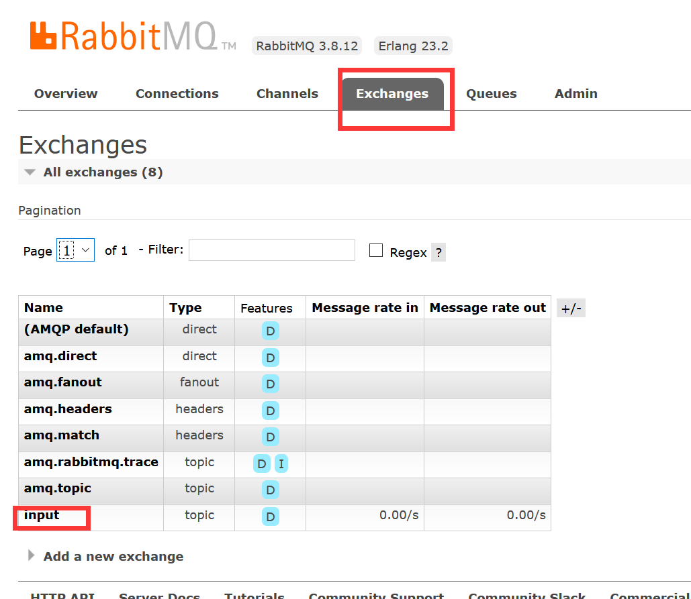
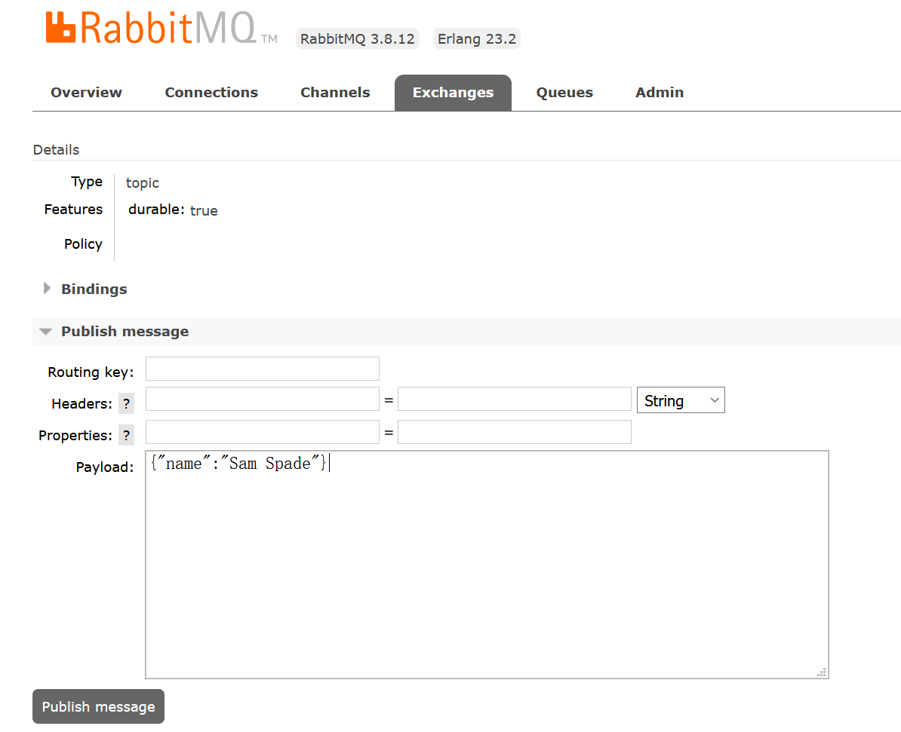

# 一、启动方式
这里程序使用Rabbitmq作为消息中间件，`Sink.class、Processor.class`等中的INPUT和OUTPUT的名称对就的是rabbitmq中的交换机的名称。

1. 先启动本地的Rabbitmq，本地的Rabbitmq已经安装好的，可以直接在菜单中点击Rabbitmq-service start，启动后可以通过http://localhost:15672这个地址进入 Rabbitmq的控制台，进入控制台之前需要设置**启用控制台**。

   

2. 启动主程序`com.xiaojihua.springcloudstream.SpringcloudstreamApplication`

3. 在Rabbitmq控制台发送消息

   

   

4. 查看控制台发现会有消息输出

   